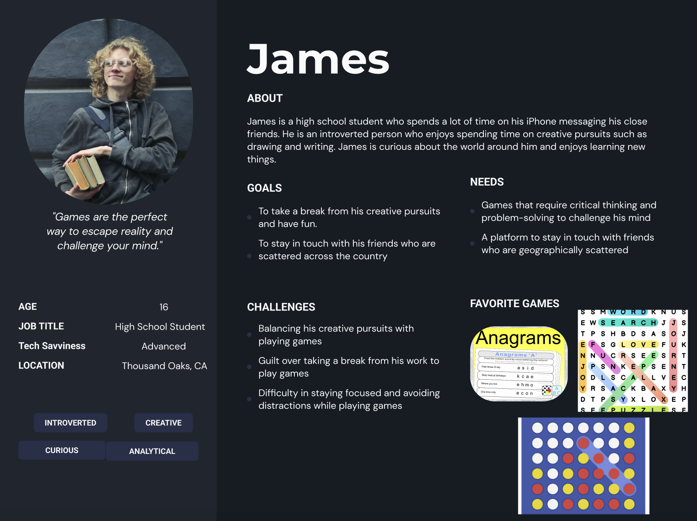

# DH 110 Assignment 4- Disha Beeraladinni

## Persona + Scenario

### Purpose of Storytelling

### Improving GamePigeon

After experience with GamePigeon as well as user research in the prior assingments, I have identified two features of the game platofrm to improve upon.

1. Customization: Some users have expressed a desire for more customization options within the games. For example, allowing users to select different backgrounds, game pieces, or music could enhance the user experience and make the games more personalized.

2. Social Features: While GamePigeon does provide a platform for playing games with friends, implementing a social feature could be improved. For example, adding more chat options, allowing users to create custom avatars, or integrating social media could enhance the social aspect of the app and make it more fun and engaging for users.

### Persona Creation and Empathy Maps

### Persona 1: Sarah

### Empathy Map:

### Persona 2: James

### Empathy Map:

### User Scenario and Journey Map

### Sarah's Scenario:

Sarah is a college student who loves spending time with her friends, but lately, it's been difficult to get together in person due to busy schedules and distance. One day, while scrolling through social media, she comes across a post from a friend who recommends GamePigeon as a fun and easy way to stay connected and play games together, even when they can't be in the same place.

Intrigued by the idea, Sarah decides to download the app and give it a try. She finds that it's easy to navigate and offers a wide variety of games, including classics like pool and checkers, as well as newer games like Anagrams and Tanks. Sarah enjoys playing games with her friends, but she finds that the social features are somewhat limited. She wishes she could chat more easily within the app or customize her avatar.

As Sarah plays more games on GamePigeon, she becomes frustrated with the app's limited social features. She finds that she can't send a message to her friend during a game, or when she wants to invite a new friend to play, she can't find an easy way to do so. Sarah begins to feel like the app is lacking something, and she considers finding a different app to use for staying connected with her friends.

Despite her frustrations, Sarah decides to send feedback to GamePigeon. She wants the app to be better and feels like her suggestions could make a difference. Sarah suggests adding a chat feature to the app, as well as the ability to create custom avatars and backgrounds. She believes that these changes could make the app more fun and personalized, which would encourage her to use it more often.

A few weeks later, Sarah receives a notification from GamePigeon announcing a new update with enhanced social features. She is excited to see the changes and immediately begins using the new chat feature to connect with her friends while playing games. She enjoys being able to customize her avatar and feels like the app is more personalized and fun. Sarah feels heard and valued by the GamePigeon team, and she appreciates that they took her feedback seriously and made improvements to the app based on user suggestions.

Sarah is pleased with the improvements made to GamePigeon's social features, and she continues to use the app regularly to play games and connect with friends. She recommends it to other friends as a fun and easy way to stay connected and have fun together, even when they're apart. Sarah feels like the app has become an important part of her social life, and she appreciates that GamePigeon continues to listen to user feedback and make improvements to the app.

