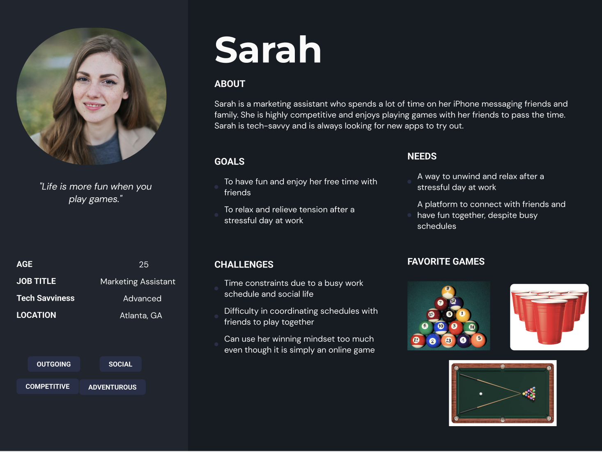

# DH 110 Assignment 4- Disha Beeraladinni

## Persona + Scenario

### Purpose of Storytelling

### Improving GamePigeon

After experience with GamePigeon as well as user research in the prior assingments, I have identified three features of the game platofrm to improve upon.

3. Social Features: While GamePigeon does provide a platform for playing games with friends, implementing a social feature could be improved. For example, adding more chat options, allowing users to create custom avatars, or integrating social media could enhance the social aspect of the app and make it more fun and engaging for users.

### Persona Creation and Empathy Maps

### Persona 1: Sarah

### Empathy Map:

### Persona 2: James

### Empathy Map:

