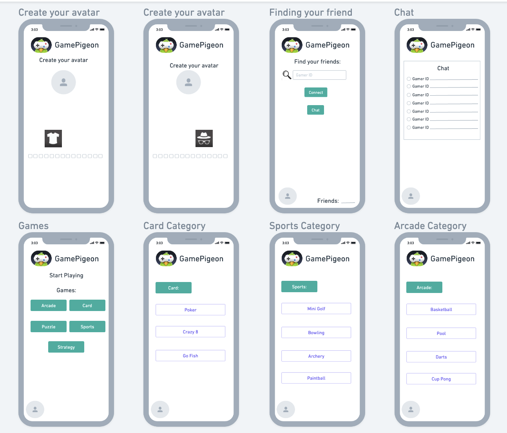

# DH 110 Assignment 5- Disha Beeraladinni
## Low-Fidelity Prototype

#### The purpose of low-fidelity prototyping is to create a simple, rough, and unfinished representation of a design idea or solution that can be easily and quickly modified based on feedback and testing. By creating a physical or digital prototype, designers can test and validate their design concepts with users, get feedback, and improve their designs before moving on to high-fidelity prototyping and development.

#### By making a low-fidelity prototype, I can test the features of my design and make any improvements. My project focuses on supporting users in being able to connect with family and friends by playing games. 

## Scenarios/Tasks: 

The two scenarios/tasks I have created are:
1. Sarah: A very tech-savvy marketing assistant who wants to stay connected to her friends despite her busy schedule. One day, while scrolling through social media, she comes across a post from a friend who recommends GamePigeon as a fun and easy way to stay connected and play games together, even when they can't be in the same place.

Task: Sarah wants to use the customization features: such as creating her own avatar, choosing the bacnkground music, and background of the game. 

2. James: An introverted high school student who loves to play mobile games during his free time but doesn't feel connected to his opponent while playing. He first discovered GamePigeon through a friend who recommended it as a fun way to pass the time. James downloads the app and starts playing his favorites on it: Mancala, Word Hunt and Connect 4.

Task: James wants to feel connected to his friends/opponents while playing the games. Hence he utilizes the chat option during the game to communicate about the intensity/direction of where the game is going and likes his friend's avatar. He also shares his game progress to his other friends. 

## Wireframe:

## WireFlow

Sarah's Task:

James's Task:

## Tester

Here is a [link](https://photos.app.goo.gl/2rTTgNVbAqr3oVGr9) to the tester of the prototype. The audio did cut out and was unable to retrieve it. Since I was didn't record to cloud, there is no transcript. Overall, the tester's remarks were that "there should also be another feature like signing in to the app using another app, for example: signing in through google instead of signing up and going through the whole process". He also mentioned that the wireframe was easy to follow and the tasks were easy to navigate.

## Reflection

Overall, this was my first time designing a prototype for this application and it was an interesting experience to use my creative outlet in designing the interface. Trying to come up with scenarios for various kinds of users made me think out of the box. I used the wesbite: Whimsical for the first time and it was cool to design using buttons, labels, tabs, and simply put my vision on the screen. As mentioned in the tester's remarks, in addition to the sign up/login page, there should also be another option such as signing in through google. As most users have a Google account, it would be easier for users to sign in, intead of creating an account. I would implement this by including another button saying "sign in through Google". I learned that the the benefits of low-fidelity prototyping are numerous. Firstly, it allows designers to generate multiple design alternatives at a low cost, which is important when exploring a range of design solutions. It also helps designers to identify potential issues and opportunities in the design early on, which can save time and resources in the later stages of development. This approach can ultimately lead to a better final product that meets the needs of users and is more likely to be successful in the market. Additionally, low-fidelity prototyping can be a useful tool for communicating design ideas to stakeholders and getting buy-in for a particular approach
