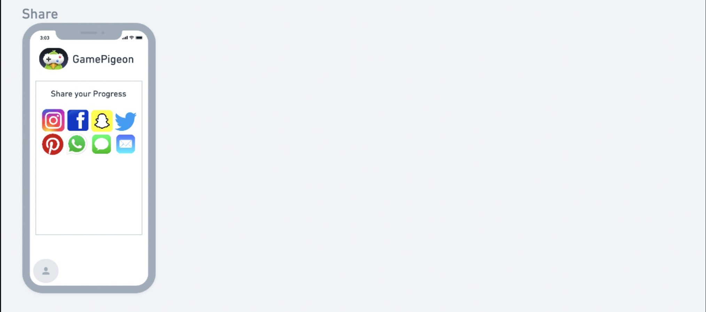

# DH 110 Assignment 5- Disha Beeraladinni
## Low-Fidelity Prototype

#### The purpose of low-fidelity prototyping is to create a simple, rough, and unfinished representation of a design idea or solution that can be easily and quickly modified based on feedback and testing. By creating a physical or digital prototype, designers can test and validate their design concepts with users, get feedback, and improve their designs before moving on to high-fidelity prototyping and development.

#### By making a low-fidelity prototype, I can test the features of my design and make any improvements. My project focuses on supporting users in being able to connect with family and friends by playing games. 

## Scenarios/Tasks: 

The two scenarios/tasks I have created are:
1. Sarah: A very tech-savvy marketing assistant who wants to stay connected to her friends despite her busy schedule. One day, while scrolling through social media, she comes across a post from a friend who recommends GamePigeon as a fun and easy way to stay connected and play games together, even when they can't be in the same place.

Task: Sarah wants to use the customization features: such as creating her own avatar, choosing the bacnkground music, and background of the game. 

2. James: An introverted high school student who loves to play mobile games during his free time but doesn't feel connected to his opponent while playing. He first discovered GamePigeon through a friend who recommended it as a fun way to pass the time. James downloads the app and starts playing his favorites on it: Mancala, Word Hunt and Connect 4.

Task: James wants to feel connected to his friends/opponents while playing the games. Hence he utilizes the chat option during the game to communicate about the intensity/direction of where the game is going and likes his friend's avatar. He also shares his game progress to his other friends. 

## Wireframe:

## WireFlow

