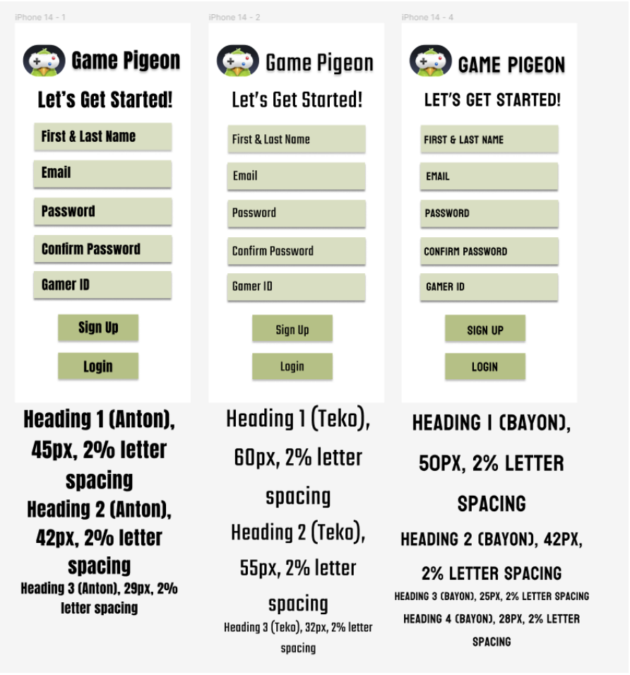
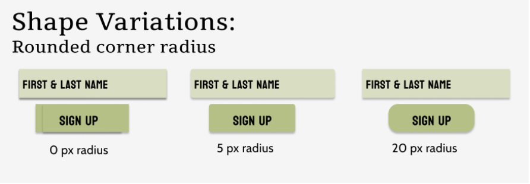
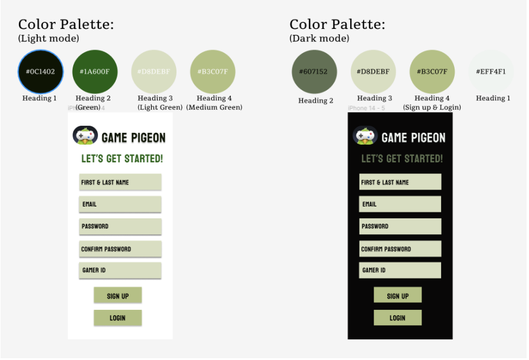
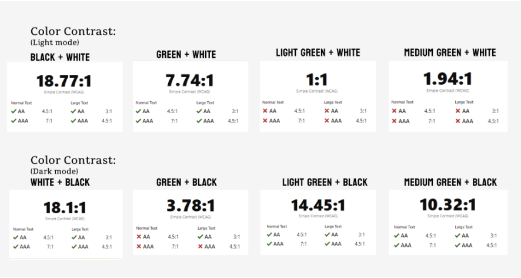
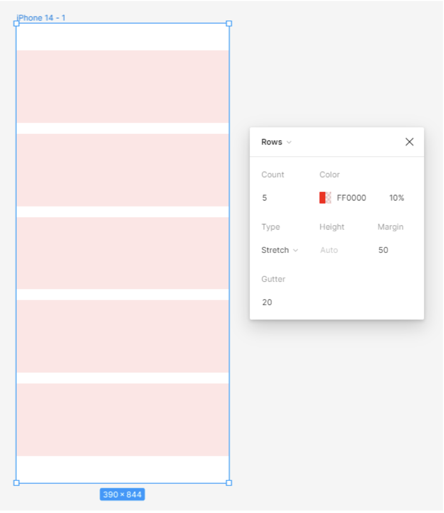
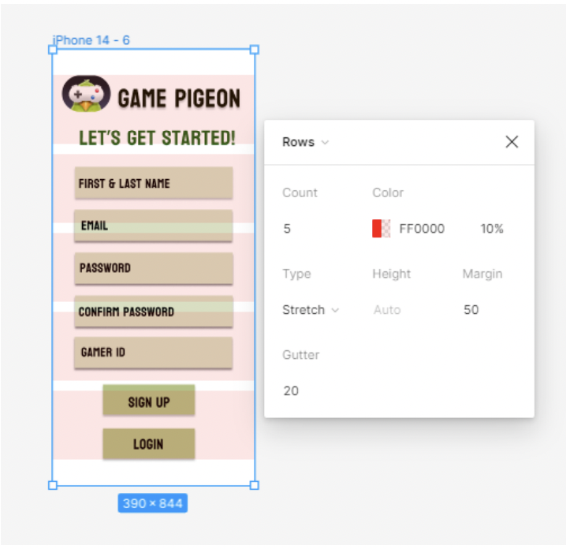
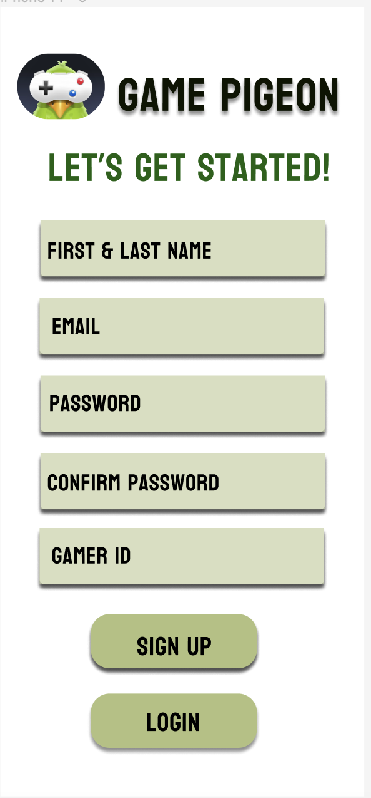

# DH 110 Assignment 6- Disha Beeraladinni
## Interface Design

### Description of Project

My goal for this project is to design an app where people of all backgrounds and ages as well as technical levels have the chance to play games with the click of a text button. The screen I designed is the sign up/login page as it will be the first page in the interface once users download the app. It is important for the sign in/login page to attract a users since most wesbites/apps ask a lot of information during this process which demotivates the user to continue. Includuing a simple and minimilatic interface would help this.

### Purpose of Interface Design

The purpose of interface design is to create user interfaces that facilitate effective and efficient interactions between humans and digital systems, such as software applications, websites, or electronic devices. Interface design focuses on designing visually appealing and intuitive interfaces that enhance the user experience and enable users to accomplish their goals easily. For this assignment, we are bringing paper vision digitally in order to create a consistent user friendly experience.

### Design Process

I first created my prototype on paper and then later implemented it digitally using Figma. On Figma, I chose a phone frame as GamePigeon since it is primarily used on messaging platforms. After all the information logistics, I implemented a grid to determine the best information structure. Then, I determined the typography styles of all texts, which would immediately give a rough estimate of the shapes and sizes of the buttons. After several rounds of iterations of the wireframe, I developed a color scheme for both themes: light and dark. 

### Links to Figma file and prototype

Here is the [Figma](https://www.figma.com/file/i7iszb2qpmTnHfjRvyTqXT/Untitled?type=design&node-id=0%3A1&t=GWsnm8JbSbIGJMnB-1) file of the interface designs

Here is the [Figma prototype](https://www.figma.com/proto/i7iszb2qpmTnHfjRvyTqXT/Untitled?type=design&node-id=3-211&scaling=scale-down&page-id=0%3A1)

## Screen Interface Designs

### Typographic Variations

I decided to compare three fonts: Anton, Teko, and Bayon. Since it is a game app, I wanted to opt for a clean and modern look as well as coinciding with a gaming theme on a phone. I decided to use Bayon as it provided an unique appeal. 

### Shape Variations

### Color Palettes

### Color Test

### Layout

This is the layout for the design. It uses phone frame with a 5 column grid with a 50 px margin. I picked a phone frame because this game is primarily played on phones as usually sent as a text message. 

## Impression Testing

[Link to testing](https://photos.app.goo.gl/nbTKdM3qHqPJ2T2Y6)

#### During my impression testing, I did a 5 second test and showed the design for 5 seconds. After the 5 second test, I asked her for her first impressions and what she could recall about the design. The following are her first impressions:

* "Very clean and organized. I like [how] there was a logo"
* "I like the color coordination, very like relaxing colors, like earth tones neutral. I'm a fan of those"
* "Very aesthetically pleasing"
* "I also like how all the boxes were the same size"

Then with the prototype link on zoom, I asked her for more feedback. This is what she said:

* Like the color palette "because it kind of matches the bird"
* The font is reasonable
* "I think maybe the one thing I do is split it like the lines [in the first and last name button]. I feel like often when they make you enter like your first and last name. They make you do separate because there's too many ways for people to mess that up."
* The interface has a "good feeling" and doesn't make me feel stressed about playing games

## Final Design

This is the final design of the interface:

* Layout: phone frame with a 5 column grid with a 50 px margin
* Shape: 5 px heading 3 buttons and 20 px buttons
* Font: Bayon with 2% letter spacing
* Color: light mode with the corresponding palette

### Summary 
