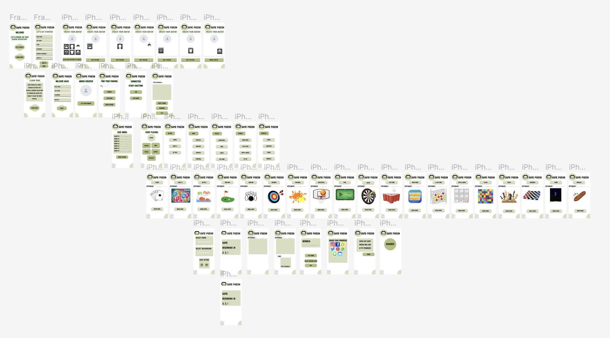

# DH 110 Assignment 7- Disha Beeraladinni

## High Fidelity Prototype

### Description of Project
My goal for this project is to design an app where people of all backgrounds and ages as well as technical levels have the chance to play games with the click of a text button. This app fulfills the user’s basic need of staying connected with friends and family and including a belonging of love. By playing games online, it allows users to connect and play games with their friends, even if they are not physically in the same location. This can help users feel more connected and involved in their friendships, which can lead to a greater sense of belonging and love as well as create memories.

## Purpose of Project
The purpose of this project is to efficiently build a gaming app that allows users to stay connected to their family members. This is through the tasks that can be performed after receiving feeback for the initial stages of the wireframe. 

## Process of Project
The protoype was created on Figma, a UI/UX platform that helps create prototypes. I first drew out my wireframe on paper and then digitalized it using the features on Figma. For the interface design, I performed impression tests to get feeback on the color palette, typography, and shape variation. 

## Tasks:
With this revised prototype, the user will be:
1. Creating their own avatar, choosing the background music and background of the game. 

On the homepage, the user has the ability to sign up or login into Game Pigeon. From there, the user creates her own avatar through 6 different features: background color, face, facial features, hair, skin, and accessories.

2. During the game, utilizing the chat option during the game, and sharing their game progress once the game is over.

## WireFrame
Here is a picture of the wireframe:

## Prototype
Here is the final [prototype](https://www.figma.com/proto/zk5Wfaqx0rUgu1ntqOQqnz/high-fidelity-prototype?type=design&node-id=9-126&scaling=min-zoom&page-id=0%3A1&starting-point-node-id=9%3A126&show-proto-sidebar=1)

## Feedback

Durig the Cognitive Walkthrough, this is what my peers mentioned:

1. "Many screens need the "back" button or other exists to help users go back to the previous page or homepage if they want to change any avatar settings or if they want to restart". 

2. "Many screens need specific content. Everything should look like a "real" app, which includes comprehensive content, instead of black "winners," "opponents," or "backgrounds"'

Mainly my protoype didn't include a back button making it not appear as an "app". With this feedback, I would add a back button on all of my screens to help users go back instead of exiting the app and restarting again. This would improve efficiency and not make users frustrated.  

