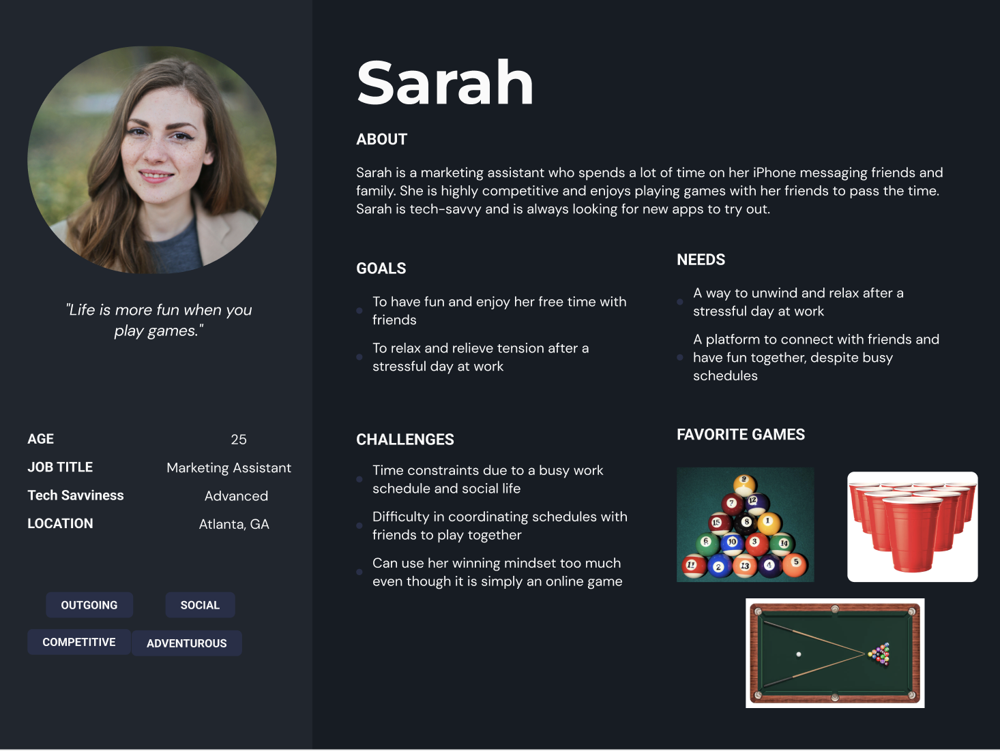
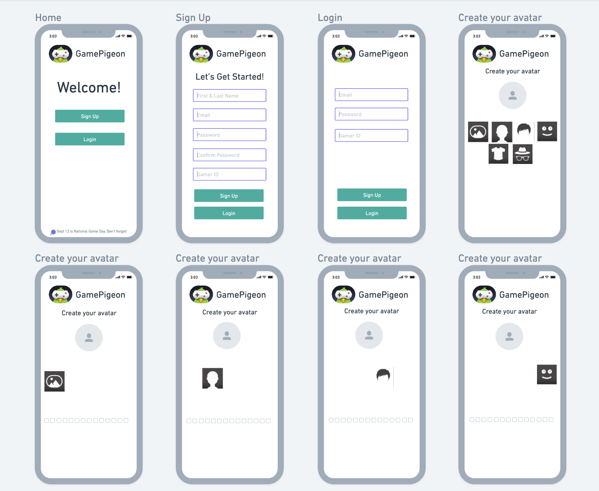
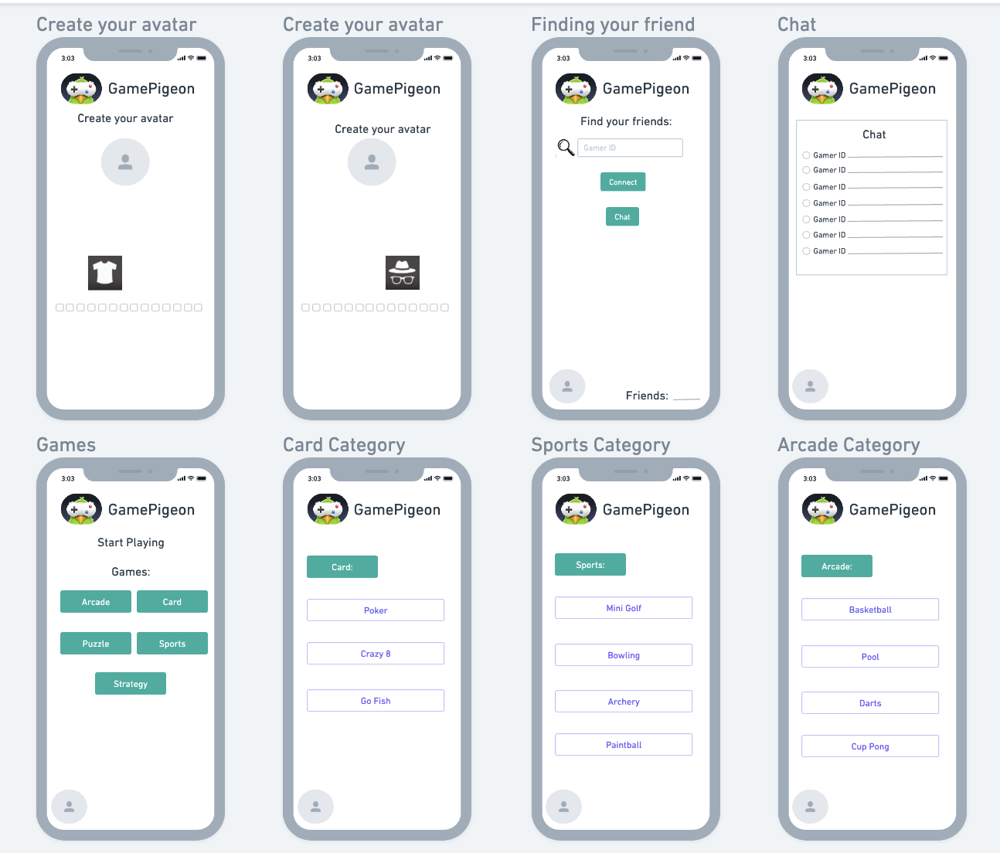
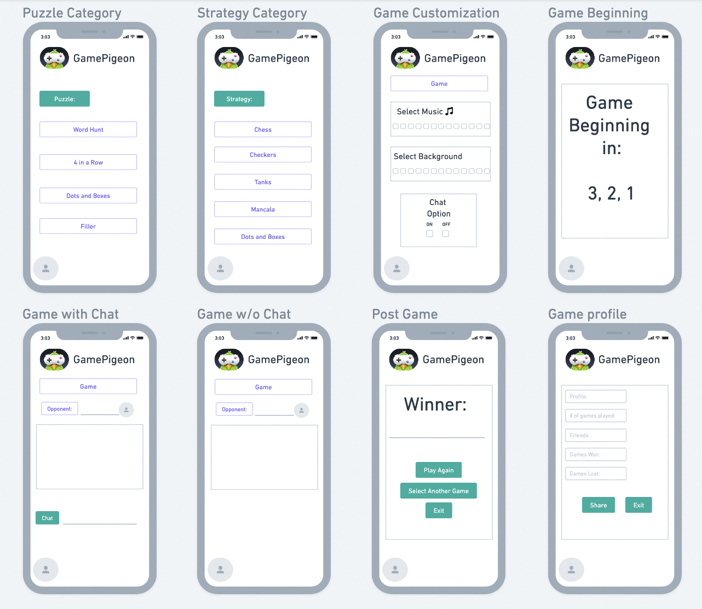
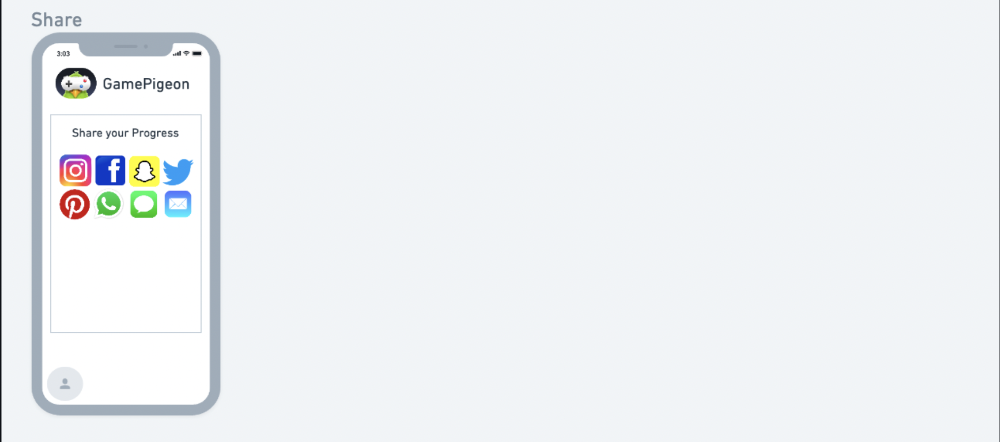

# GamePigeon UX Redesign

## UX Project by Disha Beeraladinni

Introduction: This project, conducted through the course Digital Humanities 110 in Spring 2023 at UCLA, involved redesigning GamePigeon to be more user-friendly for all levels of tech users using research and design process: heuristic analysis, usability testing, contextual inquiry and user research to designing and testing my own prototype on Figma.

###  Clear design statement: 
The design of the project support users in being able to connect with family and friends by playing games. Specifically, a variety of games that facilitate connection and a greater sense of belonging of love. By playing these games online, it allows users to connect and play games with their friends that creates memories, even if they are not physically in the same location. 

### Competitor analysis:
In order to reach my design statement, I was thinking of resdesigning the applications: Heads Up and Whatsapp, to develop a more connected feeling for users. However, Whatsaap already being a huge platform for connecting family/friends through messaging, video calling, and audio calling; there leaves little room to redesign and implement any updates for satisfactory user experience. On the other hand, Heads Up is one of the games that allow users to stay connected and have fun with each other but requires everyone to be in the same location. With this analysis and heuristic evaluation, I decided to redesign GamePigeon where people of all backgrounds and ages as well as technical levels have the chance to play games with the click of a text button. Here is a snapshot of my heuristic evaluation comparing Heads Up vs Whatsaap, and can read more [here](https://github.com/dishabeeraladinni/DH110-Spring23/blob/main/Assignment01.md):

Heads Up:

| Heuristic & Description | Heuristic Evaluation | Improvement
| :---                    |    :----:            |          ---: |
|1. Visibility of system status: Provide users the status of the game and what each button on the interface performs | Good: Turns green when the player successfully guesses the word and red otherwise; indicated when the time is up.                | No Improvement: The green and red are obvious colors making it clear for the users/players of what the game does.              |
|2. Match between system and the real world: The app should speak the user's language and general knowledge | Good: It offers categories and difficulty level based on the user's preference. It also allows them to choose the category and time limit they prefer.               | No Improvement: This is helpful as it makes the game very entertaining and engaging with preferred choices.              |
|3. User control and freedom: Allow users to navigate the app easily | Good: Users can easily pause/resume and quit the game. They can even create their own category of cards and customize their own settings.                | No improvement: This is really helpful for users of when they can pause/resume the game. The customization brings users to have a fun time with their friends/family.              |
|4. Consistency and standards: Follow established design and interaction standards, such as using familiar icons and terminology, and maintaining consistency in the layout  | Good: Includes a minimalist interface with a list of categories to choose from, such as movies, animals, and famous people, and users can swipe left and right to view more categories. Also includes animations and sound effects make it easy to use and engaging.         | No Improvement: This doesn't restrict to only one category and gives the users/players more freedom with the topics.                |
|5. Error prevention: Prevent errors by providing clear instructions and feedback to users | Bad: Doesn;t provide an undo button or a button to prevent the user from loosing their progress.                 | Improvement: Including an undo button would be helpful for accurate results or an extra chance to makeup for the missing card.               |
|6. Recognition rather than recall: Minimize user's memory in navigating the interface and app should be easy to navigate  | Good: When a user tilts their phone up, the app displays an arrow pointing up to indicate that they are skipping a card. When a user tilts their phone down, the app displays an arrow pointing down to indicate that they are guessing a word or phrase correctly               | No Improvement: This is helpful for the player as they are guided to whether they successfully guessed the card or not. |
|7. Flexibility and efficiency of use: Customize the usage of the app based on user's preference | Good: Allows users to choose their preferred category, difficulty and time limit               | No Improvement: This helps users to enjoy their time when playing the app.                |
|8. Aesthetic and minimalist design: Uses clear and concise language to communicate information to users on the app interface  | Good: Utilizes a simple color scheme of white, black, and blue. The font is clear and easy to read, and the icons are intuitive and easy to understand. The animations and the sound effects makes the game more engaging and fun.               | No Improvement: This elevates the quality time of the group of players playing Heads Up; especially with family members/friends.               |
|9. Help users recognize, diagnose, and recover from errors: Error messages/problems should be expressed and suggest a solution to solve them | Bad: Doesn't incllude a question bot on the app.              | Improvement: Including a bot would be helpful for the players in receiving immediate solutions.               |
|10. Help and documentation: Provide clear instructions to help users navigating the app | Good: The app provides a link to a support page on the developer's website which includes frequently asked questions. Also includes a help section that contains detailed instructions on how to play the game.                 | Improvement: Having a question bot/support page on the app would make it helpful to anser any questions.               |

Whatsapp:

| Heuristic & Description | Heuristic Evaluation | Improvement
| :---                    |    :----:            |          ---: |
|1. Visibility of system status: Provide users the status of the game and what each button on the interface performs | Good: Clearly shows when the messages/media/documents have been delivered and turns blue instantly they have been read by the receiver. Also shows _typing_ when the user is typing a message or _busy_ when in a call on the app                | No Improvement: This is helpful when connecting with friends/family and being able to see the status of the media/messages exchanged gives a sign of relief. Showing what time the messagees where read is helpful for users.             |
|2. Match between system and the real world: The app should speak the user's language and general knowledge | Good: Offers the option of selecting the user's language and using the app in the user's preferred language.           | No Improvement: This is helpful as it allows non English speakers to navigate the app in their preferred language and connect with their family/friends.              |
|3. User control and freedom: Allows users to navigate easy on the interface | Good: Users have the ability to delete/archive their messages/media and control their privacy settings (who can see their profile picture and status). Bad: It can be difficult to get to the privacy page especially for non-tech users as it consists of layers. Once at the privacy section, there are many options/choices to navigate through.              | Improvement: Make the privacy section more visible.              |
|4. Consistency and standards: Follow established design and interaction standards, such as using familiar icons and terminology, and maintaining consistency in the layout  |Good: Follows a consistent theme and font, uses headers/bolding when necessary. Follows a white and green color scheme giving it a modern look and for the calls section, there includes a phone/video camera symbol.           | No improvement: The logo helps users what the app is designed for and the symbols are helpful for non tech users.          |
|5. Error prevention: Prevent errors by providing clear instructions and feedback to users | Good: Always asks users to provide feedback after a voice/video call.                |No Improvement: This is really helpful as the app is constantly trying to get feedback and update the app to common preferences of the users.               |
|6. Recognition rather than recall: Minimize user's memory in navigating the interface and app should be easy to navigate | Good: There includes  4 main tabs: Chat, Status, Calls, and Settings making it easier switch between each section. Bad: Once in the Settings section, there are many subsections for the privacy feature, which may be difficult for non-tech users to go through all the questions regarding privacy.               | Improvement: In the privacy subsection, it can be helpful to include a gif or visual to show what each privacy setting can do.               |
|7. Flexibility and efficiency of use: Customize the usage of the app based on user's preference  | Good: Can customize the chat wallpaper to user's preference. Bad: Doesn't provide an option to select the size and font of the chat                | Improvement: Provide shortcuts to perform frequent actions                |
|8. Aesthetic and minimalist design: Uses clear and concise language to communicate information to users on the app interface | Good: Follows a white and green color scheme giving it a modern look and the phone inside the text message logo makes it easy to navigate on the app screen. Includes 4 main tabs: Chat, Status, Calls, and Settings making it easier switch between each section.       | No Improvement: The logo is creative as it follows the app's main purpose. The colors are bright to capture the user's attention.               |
|9. Help users recognize, diagnose, and recover from errors: Error messages/problems should be expressed and suggest a solution to solve them  | Good: Always asks users to provide feedback after a voice/video call, and will get back to a solution for any expressed error.   | No Improvement: This is helpful for WhatsApp as they can make more edits/versions based on the feedback.              |
|10. Help and documentation: Provide clear instructions to help users navigating the app  | Good: Any new features on the app are taught/released on the status feature of the app                   | No Impprovement: This is helpful as users are given a tutorial in navigating any new features and allows to watch them at the user's pace.       |

### User research:
After the heuristic evaluation and concluding my project to be on the redesign of GamePigeon, I conducted a contextual inquiry on it. It included a combination of two methods: overt observation: participatory interaction and interview. 
The two activities were: 

Activity One: Finding a game on GamePigeon: I asked the user how they would approach in selecting a game to play; what kind of details do they consider?

Activity Two: Playing the game with an opponent: I asked the user to play a game with their opponent, and how they felt after being able to text a game to their friend/family. During this activity, the opponent the user was playing against was me as a choice of convenience for the user.

After these activities were conducted on zoom alongside an interview, my participant mentioned how the games on the application "opened up a new perspective" and "provides a fun way to take a break from reality". To read more, here is a [link](https://github.com/dishabeeraladinni/DH110-Spring23/blob/main/Assignment03.md) to the contextual inquiry. 

### UX storytelling [persona+scenario, assignment05]
The purpose of UX storytelling is to create a narrative that helps stakeholders, designers, and developers understand the user's experience with a product or service. By creating personas, empathy maps and scenarios, I was able to envision a user's journey through the app and coming up with potential scenarios that users might want to implement these improvments. Here are Sarah's and Jame's personas. 

Sarah:

James:

With both of these personas, I wished to improve two features that GamePigeon doesn't offer: customization and social features. Being able to customize your own avatar, game background music, and game backdrop allows users to make the app more personalized. To read more about my UX storytelling and seeing the respective journey/empathy maps, click [here](https://github.com/dishabeeraladinni/DH110-Spring23/blob/main/Assignment04.md)

### Low-fidelity prototype, Wireframe and graphic design element variation 
To further implement mh design statement, I created a low-fidelity prototype that allows me to test the features my design and make any improvements. By creating a physical or digital prototype, designers can test and validate their design concepts with users, get feedback, and improve their designs before moving on to high-fidelity prototyping and development. Here is the wireframe of my low-fidelity prototype:

### High-fidelity prototype (functional/interactive prototype, assignment08)
Summary statement and link to or an embedded prototype

<iframe style="border: 1px solid rgba(0, 0, 0, 0.1);" width="800" height="450" src="https://www.figma.com/embed?embed_host=share&url=https%3A%2F%2Fwww.figma.com%2Fproto%2Fzk5Wfaqx0rUgu1ntqOQqnz%2Fhigh-fidelity-prototype%3Ftype%3Ddesign%26node-id%3D9-126%26scaling%3Dscale-down%26page-id%3D0%253A1%26starting-point-node-id%3D9%253A126" allowfullscreen></iframe>

### Pitch video 
Conclusion: what did you learn throughout the process?

